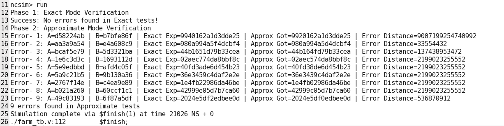
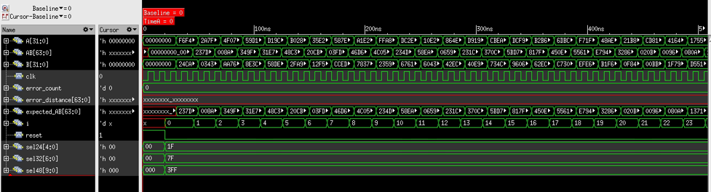
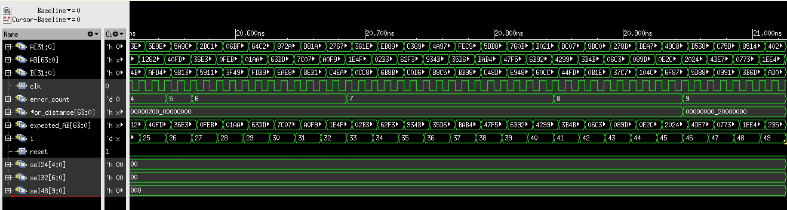
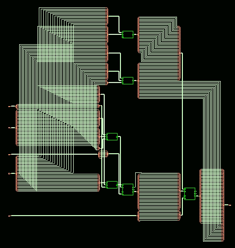
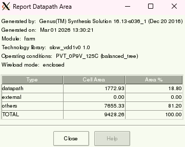
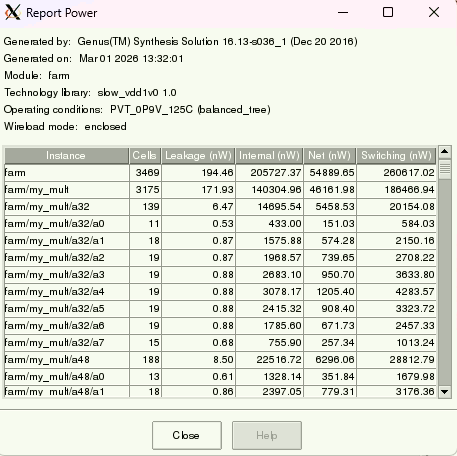
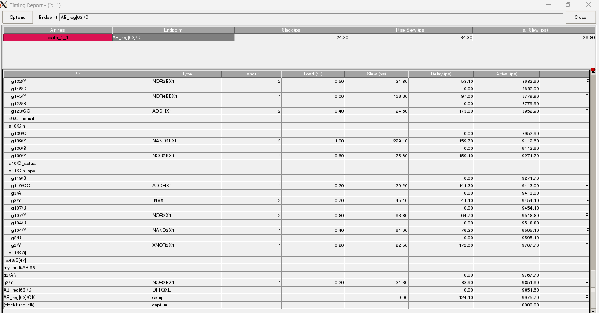
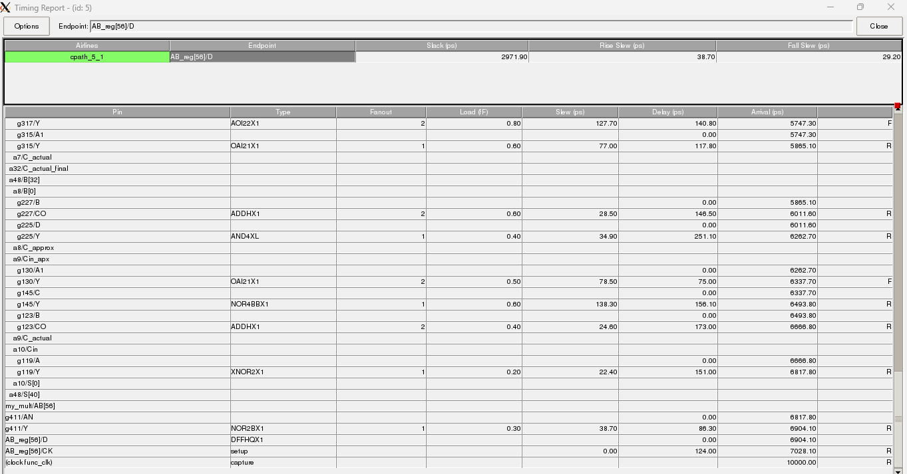

# Design and Analysis of an Accuracy Configurable Fast Approximation Recursive Multiplier (FARM)

**Status:** RTL Code and Physical Design files are currently withheld due to academic publication purpose.

## Project Overview
Error-resilient applications in domains like machine learning and signal processing require approximate arithmetic circuits optimized for speed, power, and area. This project introduces a 32-bit Fast Accurate Recursive Multiplier (FARM) integrated with a Fast Accuracy Reconfigurable Adder (FARA). 

The architecture features dynamic reconfigurability, allowing the system to switch between a fully exact, error-free mode and multiple levels of approximation at run-time. By utilizing a hierarchical divide-and-conquer approach and recursive addition of partial products, the design drastically cuts down the area overhead typically associated with complex reconfigurable multipliers.

## VLSI Physical Design Flow
The project encompasses a complete front-to-back digital physical design flow targeting a **45nm CMOS technology node**. 

* **Front-End Synthesis:** Cadence Genus was utilized to generate structural netlists and extract baseline Area, Power, and Delay metrics.
* **Back-End Physical Design:** Cadence Innovus was utilized for Floorplanning, Power Planning, Placement, Clock Tree Synthesis (CTS), Routing, and Metal Fill to achieve a tapeout-ready layout.
* **Verification:** A robust SystemVerilog Layered Testbench was developed for automated stimulus generation and self-checking across randomized test batches.

## Key Results & Metrics

The design was fully verified functionally and optimized through the physical layout phase.

Directed Testbench Result for bit exact and approximate mode with random inputs:

Waveform results for exact mode:

Waveform results for approximate mode:
  

This is the sythesized circuit from Cadence Genus:  

  

Area Report:  
  

Power Report:  
  

Timing Report for Exact Multilpier report:  
  

Timing Report for Approximate Multilpier report:  
  

### Performance & Accuracy
* **Speedup:** Delivered a speedup of over 30% (Data arrival time reduced from 9851.6 ps to 6904.1 ps) against the exact mode when configured for maximum approximation.
* **Error Control:** Exact mode operates with zero errors, preventing arithmetic overflow by utilizing a full 64-bit output path.

### ASIC Synthesis Results (45nm)
* **Total Power:** ~3.59 mW (dominated by dynamic switching power).
* **Base Synthesis Area:** 9428.26 µm².

### Physical Layout & Floorplanning
* **Core Area:** 10993.76 µm².
* **Core Utilization:** 79.97% (Optimized with a core isolation value of 0.8).
* **Die Dimensions:** Height = 110.2 µm | Width = 115.2 µm.
* **DRC & CTS:** The final routed layout passed all Design Rule Checks (0 errors) and maintained a positive setup slack (0.002 ns) at a targeted 500 MHz frequency.

## Layout Highlights
*(Add your final routed layout images and floorplan screenshots here from the `physical_design` folder)*
- ``
- ``
